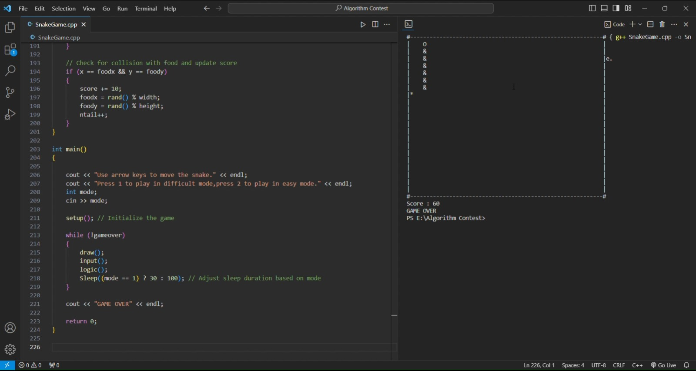

# Snake Game in C++ (Console)

Welcome to the classic Snake Game implementation in C++! This simple console-based game allows players to control a snake, collect food, and grow longer, all while aiming for the highest score without colliding with borders or the snake's tail.

## Features

- Responsive arrow key controls.
- Dynamic difficulty modes (easy and difficult).
- Score tracking.
- Game-over screen.

## How to Play

1. **Clone the repository** to your local machine.
2. **Compile the code** using a C++ compiler.
3. **Execute the compiled executable** to start the game.
4. Use arrow keys (up, down, left, right) to control the snake.
    - Up Arrow: Move Up
    - Down Arrow: Move Down
    - Left Arrow: Move Left
    - Right Arrow: Move Right
5. Press `1` for difficult mode or `2` for easy mode.
   - Difficult Mode: Faster snake movement (30ms delay).
   - Easy Mode: Slower snake movement (100ms delay).
6. The game continues until you collide with borders or the snake's tail.

## Screenshots

## Demo Video

Check out the gameplay in action on our [YouTube Demo](https://youtu.be/0yA8jrbZhTM).

## Code Overview

### Initialization

- Snake starts in the center with random food placement.
- Score begins at zero.

### Drawing

- Console-based drawing with snake represented by "O", food by "*", and tail segments by "&".
- Score displayed at the bottom of the screen.

### Input

- Arrow keys control snake direction using `_kbhit()` and `_getch()` functions.

### Logic

- Update snake positions and check for collisions.
- Tail segments follow the head.
- Borders, snake's own tail, and food collisions are checked.

### Difficulty Modes

- Two modes: difficult and easy.
- Sleep duration adjusted based on selected mode.

Enjoy the Game! 🐍

---

Feel free to replace `/path/to/screenshot1.png` and `/path/to/screenshot2.png` with the actual paths to your screenshots. Also, update the YouTube link with the correct one for your demo video.
